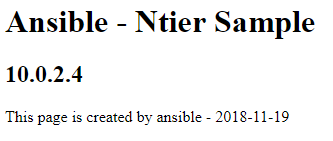
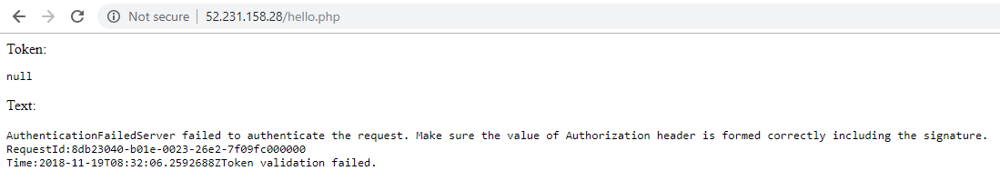
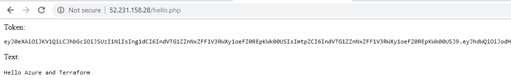

# Azure Workshop: Design and Deploy Cloud N-Tier App

## LAB1: Provision infrastructure using Terraform

Open azure cloud shell, `https://shell.azure.com`

> For reference please refer [Install and confiure](https://docs.microsoft.com/en-us/azure/virtual-machines/linux/terraform-install-configure) and
> [Quick sample: create a VM](https://docs.microsoft.com/en-us/azure/virtual-machines/linux/terraform-create-complete-vm)

### 1. Download azure-terraform sample

Download the sample.

```
git clone https://github.com/iljoong/azure-terraform

cd azure-terraform
```

### 2. Create a service principal

> You don't need to create SP if you're using Azure CLI environment, such as _Azure Shell_. See [Authenticating using the Azure CLI](https://www.terraform.io/docs/providers/azurerm/auth/azure_cli.html) for more information

Create a Azure AD service principal using CLI.

```
az account list -o table

export SUBSCRIPTION_ID=<subs id>

az ad sp create-for-rbac --role="Contributor" --scopes="/subscriptions/${SUBSCRIPTION_ID}"
```

Sample output of service principal information is following,

```
{
  "appId": "0000000000-0000-0000-0000-0000000000",
  "displayName": "azure-cli-2018-11-15-07-19-22",
  "name": "http://azure-cli-2018-11-15-07-19-22",
  "password": "xxxxxxxxxx-xxxx-xxxx-xxxxxxxxxxx",
  "tenant": "11111111-1111-1111-11111-11111111111"
}
```

### 3. Update variables value

Update variables value with _"add_here"_ in `variable.tf`, such as appId, password and etc.

Note that be sure `prefix` variable is _globally uniquey_ and use _complex_ `password`.

> You could also change some variables in `vm-app.tf`, `vm-web.tf` and etc.

### 4. Run terrafrom

Run terraform script.

```
terraform init
terraform apply
```

Note that provision will take about 2 minutes and output is something like following,

```
Outputs:

jumphost_ip = 52.231.161.228
nat_ip = 52.231.166.126
weblb_pip = [
    52.231.158.28
]
```

### 5. Browse to web

Browse to web frontend `http://52.231.158.28`.

Note that endpoint of web is weblb_pip

### 6. Login to jumphost

Login to jumphost, use `user name` and `password` you specified in `variable.tf`.

```
ssh azureuser@52.231.161.228
```

### 7. Test web and app host

At jumphost, ping(curl) test to hosts with internal ip.

```
curl 10.0.1.4
curl 10.0.2.4
```

Note that curl `10.0.2.4` is not responding due security configuration by ASG.

### 8. Test app host in web host

At jumphost, login to a web host (10.0.1.4).

run ping test again.

```
curl 10.0.2.4
```

This time it will work since ASG configured so that it allows traffic from web to app.

### 8. Test SNAT

Logout from webserver then login to a app server (10.0.2.4) and test following,

```
curl ipinfo.io
```

Output will be something like below,

```
{
  "ip": "52.231.166.126",
  "city": "Busan",
  "region": "Busan",
  "country": "KR",
  "loc": "35.1028,129.0400",
  "org": "AS8075 Microsoft Corporation"
}
```

Note that outbounding IP is the same as nat_ip.

## LAB2: Install and configure service using Ansible

### 1. Install Ansible

At jumphost, install `ansible`.

```
sudo apt update
sudo apt install -y ansible sshpass
```

### 2. Download ansible sample

Download sample.

```
git clone https://github.com/iljoong/ansible-sample
cd ansible-sample
```

> You could also try `cert` branch to enable HTTPS endpoint.

### 3. Pingtest

First, test `pingtest` sample.

```
ansible -i hosts.pass all -m ping
```

### 4. Ntier

Then, run `ntier` sample.

```
ansible-playbook -i hosts site.yaml
```

Note that you need to update variables (_user, password, blobname_) in `ntier/group_vars/all` before run this sample.

> If you skipped login to web and app hosts then playbook will fail so you should login to host before running this script.

### 5.  Browse to web again

Browse to web frontend `http://52.231.158.28` again.

Output of page is now different.



## LAB3: access stroage using MSI

### 1. Browse to 'hello.php' page

First, browse to `http://52.231.158.28/hello.php`

You will see an error page. This is because you don't have a token to access the blob storage.



### 2. Enable MSI

Enable or assign MSI identity on the application VMs.

```
az vm identity assign -g <rgname> -n <appvm01>
```

You can also do this in portal.

### 3. Assign role (IAM)

Assign ("Storage Blob Data Contributor (Preview)") IAM role to the application VMs.

```
# get VM principalId (assignee)
#az vm identity show -g <rgname> -n <appvm01>

# get role id
az role definition list --query '[?roleName==`Storage Blob Data Contributor (Preview)`].[roleName, name, id]'

# get storage scope
az storage account show -g <rgname> --name <storageacct> --query "id"

# apply role
az role assignment create --role "ba92f5b4-2d11-453d-a403-e96b0029c9fe" --assignee <identity> --scope /subscriptions/xxxxxxxxxx-xxxx-xxxx-xxxxxxxxxxx/resourceGroups/<rgname>/providers/Microsoft.Storage/storageAccounts/blobacct
```

or In portal, go to blob storage -> IAM -> assign `Storage Blob Data Contributor (Preview)` and select the VM.

### 4. Browse again

Browse to `http://52.231.158.28/hello.php` again.

Now you will see the content of 'hello.txt' file in the blob storage.



### 5. Download and upload test

_This is optional_

Login to app host and do download/upload a file from/to blob storage.

> http://iljoong.github.io/azure/2018/05/23/Azure-Blob-AAD.html

### Reference

> For reference please refer [access storage](https://docs.microsoft.com/ko-kr/azure/active-directory/managed-identities-azure-resources/tutorial-linux-vm-access-storage), [using access key](https://docs.microsoft.com/en-us/azure/active-directory/managed-identities-azure-resources/tutorial-linux-vm-access-storage-access-key) and [using KeyVault](https://docs.microsoft.com/en-us/azure/active-directory/managed-identities-azure-resources/tutorial-linux-vm-access-nonaad).

## LAB4: Add WAF

_this is optional_

https://github.com/iljoong/azure-tf-waf

## LAB5: Replace with HA-NAT-VMSS

_this is optional_

https://github.com/iljoong/HA-NAT-VMSS