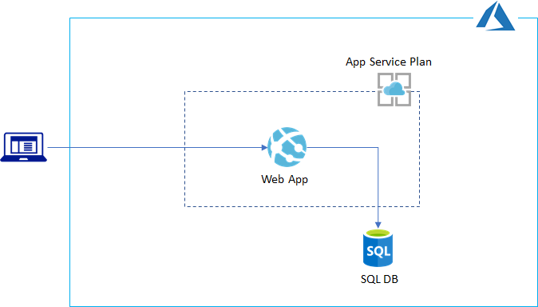

# Azure Workshop: Design and Deploy Azure PaaS App

## Overview

One of challenges for provisioning PaaS services is deploying applications since `terraform` does not provide native way of deploying apps (e.g, Web App and setup MS SQL). This LAB terraform shows how to deploy and configure webapps and MS SQL using `terraform`.

This lab will demonstrate how to provision/deploy/config Azure PaaS using __Terraform__.

In this lab, you will learn how to:

- create a terraform script for Azure PaaS services, such as Web App and SQL Database.
- create an app deployment script leveraging _ARM tempate deployment_ and _local_exec_ provided by Terraform.
- setup SQL database using `sqlcmd` tool

## Hands on Lab

[Workshop HOL](./ws_hol.md)