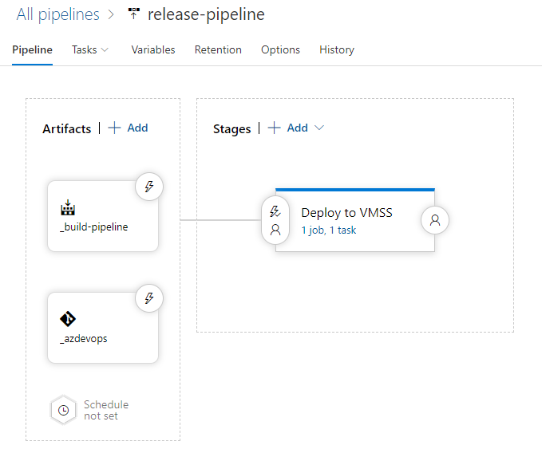

# Azure Workshop: DevOps in Practice

> Please refer sample devops template [https://github.com/iljoong/azure-devops](https://github.com/iljoong/azure-devops)

## LAB0: Prepare Environment

1. prepare azure environment
    - Azure DevOps
    - Virtual Network
    - Key Vault
    - Blob account
2. create `adminpassword` secret and upload _SSL certificate_ to your keyvault 
3. upload files in [azure/blob](https://github.com/iljoong/azure-devops/tree/master/azure/blob) to blob account and update variables
4. prepare DevOps agent
    - provision a Window VM for build agent
    - install devops agent software on build agent

> __Note 1:__ This lab will use a _self-hosted agent_ to build and release pipeline. For more information, please refer [Self-hosted Windows agents](https://docs.microsoft.com/en-us/azure/devops/pipelines/agents/v2-windows?view=azure-devops).<br>
__Note 2:__ If you don't have your own SSL certificate then you can generate a [self-signed certificate in Key Vault](https://docs.microsoft.com/en-us/azure/key-vault/create-certificate)

## LAB1: Create a Project and test deployment

> For how to run `packer` and deploy to VMSS, please refer [.NET Core App Deployment to VMSS](https://github.com/iljoong/dotnet-vmss).

1. create a dotnet project

```
dotnet new webapi -o apiapp -n apiapp
```

2. test `packer` build

- create a new packer template, please refer [packer.json](https://github.com/iljoong/azure-devops/blob/master/packer/packer.json)

3. test VMSS deployment

- create an ARM template, please refer [vmss.json](https://github.com/iljoong/azure-devops/blob/master/template/vmss.json)
- update variables in parameter files [vmss.parameters.json](https://github.com/iljoong/azure-devops/blob/master/template/vmss.parameters.json)
- deploy VMSS using this template

> If you test in your local PC then you need to install `packer` and `az cli`. If you don't want to install tools then you may test in Azure Cloud Shell. 

## LAB2: Create a CI/CD pipeline

### CI (Build) pipeline

1. create a new project in __Azure DevOps__
2. push app source to the project reop
3. create a build pipeline
    - create a new pipeline and import [build-pipelines.yml](https://github.com/iljoong/azure-devops/blob/master/build-pipelines.yml)
    - update with `agent pool` name
4. add __group variables__ and please refer variables in [variables.yml](https://github.com/iljoong/azure-devops/blob/master/variables.yml)
    - azure_subscription
    - azure_build
    - azure_vmss
5. add a __service connection__ for _Azure Subscription_ and name it `My_Azure_Subscription`

> _Trigger_ is disabled in sample template.

### CD (Release) pipeline



1. create a new release pipeline ([release-pipeline](https://github.com/iljoong/azure-devops/blob/master/azure/release_sample/release-pipelines.yml)) and choose `empty job`
2. create a stage and name it `Deploy to VMSS`
3. assign agent pool to your agent VM for this job
4. create a _Azure resource group deployment_ task
    - choose `Linked artifact` in Template location and update `template`, `template parameters`
5. add following override template parameters
   ```
    -vmssName $(vmssName) -vmSku "Standard_D2s_v3" -instanceCount 1 -vnetname $(vnetname) -subnetname $(subnetname) -ilbip $(ilbip) -subnet $(subnet) -adminUsername $(adminUsername) -imageId "/subscriptions/$(subscription_id)/resourceGroups/$(sig_rg)/providers/Microsoft.Compute/galleries/$(sig_name)/images/$(sig_prefix)-$(Build.BuildId)/versions/1.0.$(Build.BuildId)" -vaultResourceId $(vaultid) -certificateUrl $(certificateurl) -winrmCertUrl $(winrmCertUrl) -scriptUrl $(scripturl) -appsettingsUrl $(appsettingsurl) -thumbprint $(thumbprint) -identityName $(identityName)
   ```
6. add an artifact
    - add build artifact
    - add source repo artifact
7. link variable groups (`azure_subscription`, `azure_build`, `azure_vmss`) to release pipeline

## LAB3: Build and Release

Manually trigger build and release

## LAB4: Upgrade Certificate

_this is optional_

1. create a new release pipeline ([upgrade-pipeline](https://github.com/iljoong/azure-devops/blob/master/azure/release_sample/upgrade-pipelines.yml)) and choose `empty job`
2. create a stage and name it `Upgrade certificate`
3. assign agent pool to your agent VM for this job
4. create two __Azure CLI__ tasks
5. select `Inline script` in `Script Location` and add following script in `Inline Script`
   ```
    az vmss update -g $(rgname) -n $(vmssName) --add virtualMachineProfile.osProfile.secrets[0].vaultCertificates "{""certificateUrl"": ""$(certificateurl)"", ""certificateStore"": ""My""}"
   ```
   - add another script in `Inline Script`
   ```
    az vmss update -g $(rgname) -n $(vmssName) --set virtualMachineProfile.extensionProfile.extensions[0].settings="{""fileUris"": [""$(scripturl)"", ""$(appsettingsurl)""],""commandToExecute"": ""powershell -ExecutionPolicy Unrestricted -File $(scriptfile) -thumbprint $(thumbprint)""}"
   ```
6. link variable groups (`azure_subscription`, `azure_build`, `azure_vmss`) to release pipeline

## Additional Lab

There is additional lab about working with `work item`, `branching` and `pull requests`.

[Additional HoL](./ws_hol_extra.md)