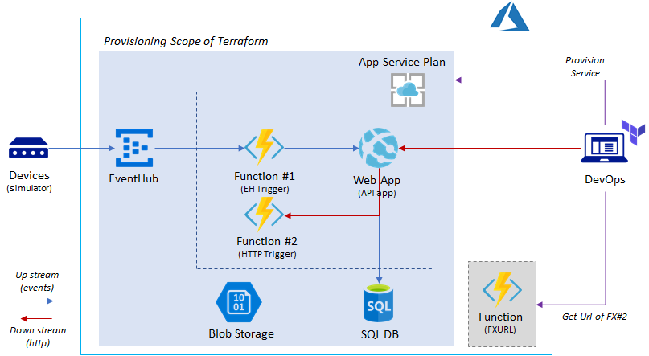

# Azure Workshop: Design and Deploy Azure PaaS App

## Overview

One of challenges for provisioning PaaS services is deploying applications. There is no industry standard way of deploying application and even __terraform__ does not provide native way of deploying apps (e.g, Web App, Function App deployment).

This lab will demonstrate how to provision/deploy Azure PaaS using __Terraform__.

In this lab, you will learn how to:

- create a terraform script for Azure PaaS services, such as Web App and SQL Database.
- setup SQL database using `sqlcmd` tool
- create an app deployment script leveraging _ARM tempate deployment_ and _local_exec_ provided by Terraform.

## Hands on Lab

Lab will use following samples:

[https://github.com/iljoong/azure-paas-tf](https://github.com/iljoong/azure-paas-tf)