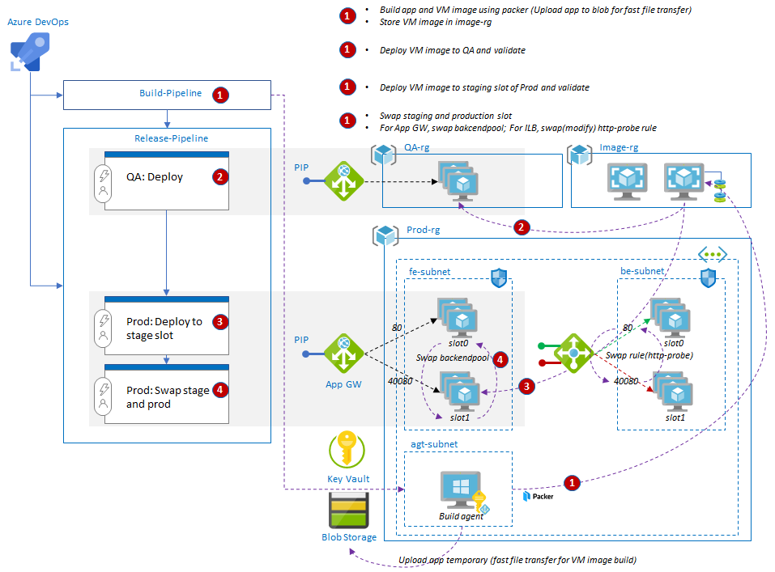
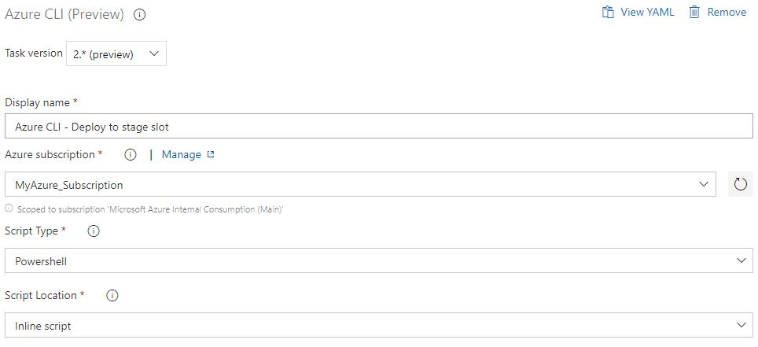
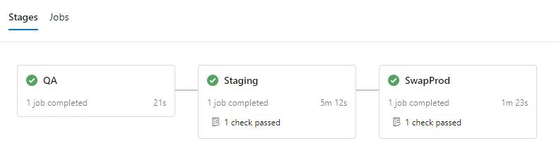

# Azure Workshop: Deployment Strategy

> Note: This lab will use VMSS as target compute service. Deployment implementation varies by different compute services.

In this lab, you'll create a multi-stage deployment for n-tier application.



## LAB0: Understand deployment strategy

There are several deployment strategies such as All-at-once(Big bang), Rolling, Blue/Green(Red/Black) and Canary. Each strategy has pros and cons and you must choose the right strategy for your service.

| Strategy        | Deploy time | Zero Downtime | Rollback Process   |
|-----------------|:-----------:|:-------------:|--------------------|
| All at once     | fast        | X             | Re-deploy          |
| Rolling         | slow+       | O             | Re-deploy          |
| Blue/Green      | slow        | O             | VIP/URL swap (fast)|  
| Canary          | slow++      | O             | Re-deploy          |

Please read this [link](https://dev.to/mostlyjason/intro-to-deployment-strategies-blue-green-canary-and-more-3a3) for more information.

VMSS does not support _blue/green_ and _canary_ deployment natively so you must build infrastructure to support these deployment methods. In this lab, we will use _blue/green deployment_ strategy.

## LAB1: Create an infrastructure for blue/green deployment

> Please refer sample template [https://github.com/iljoong/vmss-vipswap](https://github.com/iljoong/vmss-vipswap)

### LAB1-0: Prepare DevOps Environment

1. Prepare _agent VM_ for build/release pipeline and _key vault_ for securing admin password.
  - Please refer this sample [terraform](https://github.com/iljoong/azure-devops/tree/master/terraform) to setup the environment.
2. Create a new Azure DevOps project.
  - Upload sample template.
  - Add a new _Azure Resource Manager_ in __Project Settings/Service connections__ and name it `MyAzure_Subscription`.
  - Add two variables groups, `azure_build` and `azure_subscription` in __Pipelines/Library__.
    - see [variables group examples](https://github.com/iljoong/vmss-vipswap/tree/master/pipeline) for more details

> Note that you need a name of blob storage account and container for variables group. You may empty this variables for now.

### LAB1-1: VIP-swap-able VMSS architecture

In order to VIP-swap for VMSS with public/internal LB you need to configure two sets(slots) of VMSS.


You also need to modify your app so that it returns right response depends on the LB rule (http probe). That is, application's `api/ping` endpoint returns 200 or 404 depends on its matching slot with probe. Slot name is part of VMSS's name (e.g., `prod-api-vmss-slot0` or `prod-api-vmss-slot1`). Application uses IMDS to get it's VMSS's name and slot name.

```
    [HttpGet("/api/ping")]
    public ActionResult Ping([FromQuery]string slot)
    {
        string slotname = _pingManager.GetSlotName();

        _logger.LogInformation($"{slot}=={slotname}");

        if (slot == slotname)
            return Ok();
        else
            return NotFound();
    }
```
[source code](https://github.com/iljoong/vmss-vipswap/blob/0b0a20ac0652650a32d8b84d1da34bdd2b79d5df/webapi/Controllers/PingController.cs#L26)

If you're using Application Gateway instead of public LB then you don't need any special setup except providing two VMSS slots.

### LAB1-2: Build VM image using Packer

You'll build VM image using Packer for deployment. You can build manually or use a build pipeline to automate process.

Create a __new pipeline__ with `Azure Repos Git` option and configure with existing Azure pipelines YAML file in the repo. Choose `build-filecp-pileline.yml` for initial build.

Run _build pipeline_ to get the first custom VM image for initial deployment.

### LAB1-3: Improve build time

When building Windows image, if the application file size is large, say 100 MB, then copying this file takes very long time because of the way WinRM works. see [documentation](https://packer.io/docs/provisioners/file.html#slowness-when-transferring-large-files-over-winrm-) for additional information.

You can improve build time by copying build artifacts to blob storage temporary and downloading from blob in the build process. You'll need to modify build process by adding a task that upload a package and generate temporal sas url, `packageurl`.

```
- task: AzureCLI@2
  inputs:
    azureSubscription: 'MyAzure_Subscription'
    scriptType: 'ps'
    scriptLocation: 'inlineScript'
    inlineScript: |
      # get storage key
      $key = (az storage account keys list -n $(blobaccount) --query "[0].value" -o tsv)
      # upload file to blobstorage
      az storage blob upload -c $(container) -n app$(Build.BuildId).zip -f $(Build.ArtifactStagingDirectory)/app$(Build.BuildId)/app$(Build.BuildId).zip --account-name $(blobaccount) --account-key $key --no-progress
      # create sas token
      $end = (Get-Date).AddMinutes(30).ToString("yyyy-MM-ddThh:mm:ssZ")
      $sasurl = (az storage blob generate-sas -c $(container) -n app$(Build.BuildId).zip --account-name $(blobaccount) --account-key $key --permissions r --expiry $end --full-uri -o tsv)
      echo "##vso[task.setvariable variable=packageurl]$sasurl"

- task: PackerBuild@1
  inputs:
    templateType: 'custom'
    customTemplateLocation: './packer/packer_blob.json'
    customTemplateParameters: |
      {
        "packagepath": "$(packageurl)",
        "imagename":"$(imagename)",
        "rgname":"$(rgname)"
      }
```

You also need to configure [storage lifecycle management](https://docs.microsoft.com/en-us/azure/storage/blobs/storage-lifecycle-management-concepts) in your storage account to control storage cost.

Following is the snippet of terraform script that deleting any files/blobs with match `/app/app*` after 3 days.

```
resource "azurerm_storage_management_policy" "tfblob" {
  storage_account_id = azurerm_storage_account.tfblob.id

  rule {
    name    = "appretention"
    enabled = true
    filters {
      prefix_match = ["app/app"]
      blob_types   = ["blockBlob"]
    }
    actions {
      base_blob {
        delete_after_days_since_modification_greater_than = 3
      }
    }
  }
}
```

Create another build pipeline as in the above. This time choose `build-blobcp-pileline.yml`. Since you need a blob storage account to run this pipeline, it is recommended to run after LAB2-1 if you don't want to create blob storage manually.

### LAB1-4: Extra: Minimize Azure subscription privilege grant

_This is optional_

In lab environment, you assign `Contributor` role of Azure subscription to _agent VM_ through managed identity. If you concern with your _agent_ or _packer_ may have too much privilege grant to your Azure subscription, you can minimize the grant by assigning `Contributor` role only in one of your resource group. see [documentation](https://packer.io/docs/builders/azure.html#azure-managed-identity) for additional information. 

You also specify resource group by adding `build_resource_group_name` configuration in your packer script so that packer can have enough privilege to create VM images.
```
    "build_resource_group_name": "{{user `packerrgname`}}",
```

> Note: If you're using `build_resource_group_name` configuration, `async_resourcegroup_delete` won't be effective and overall baking time is increased. Currently, there is a bug that key vault resource is not deleted if you're using this configuration.

## LAB2: Create multi-stage deployment pipeline (classic editor)

You'll create multi-stage deployment pipeline with _Release Manager (classic editor)_ as below diagram.


You'll setup 3 stages:

- Stage1: Deploy to QA
  - task: deploy build image to QA (`qa-vmss`)
- Stage2: Deploy to Stage
  - task: deploy same build image to staging slot (`prod-vmss-slot1`)
- Stage3: Swap to Prod
  - task: swap to prod slot (`prod-vmss-slot1` <-> `prod-vmss-slot0`)

> You need to add appropriate variables (e.g., vmssrgname, lbname) in __Library__ before setup the pipelines.

### LAB2-1: Setup VMSS for blue/green deployment

Run [terraform scripts](https://github.com/iljoong/vmss-vipswap/tree/master/terraform) for initial VMSS deployment. This terraform script will setup a VMSS environment for blue/green deployment.

You can deploy one of LB options by choosing source module in [main.tf](https://raw.githubusercontent.com/iljoong/vmss-vipswap/master/terraform/main.tf)

- [Application G/W]
- [Public LB]
- [Internal LB]

### LAB2-2. Setup pipeline for VMSS (Public/Internal LB)

- Stage1: Deploy to QA

_skip this_stage_ or add simple powershell task for debug log.

- Stage2: Deploy to Stage

Setup Azure CLI (version 2.*) task



Inline Script
```
$m=(az network lb show -g $(vmssrgname) -n $(lbname) --query "tags.ActiveSlot" -o tsv)
if ($m -eq "0") { $n="1" } else { $n="0" }
az vmss update -g $(vmssrgname) -n "api-prod-vmss-slot$n" --set "virtualMachineProfile.storageProfile.imageReference.id=/subscriptions/$(subscription_id)/resourceGroups/$(rgname)/providers/Microsoft.Compute/images/app$(Build.BuildId)"
```

- Stage3: Swap Prod

Setup Azure CLI (version 2.*) task


Inline Script
```
# vip swap
$m=(az network lb show -g $(vmssrgname) -n $(lbname) --query "tags.ActiveSlot" -o tsv)
if ($m -eq "0") { $n="1" } else { $n="0" }
az network lb probe update -g $(vmssrgname) --lb-name $(lbname) -n http-probe --set "requestPath='/api/ping?slot=slot$n'"
az network lb probe update -g $(vmssrgname) --lb-name $(lbname) -n http-probe-stage --set "requestPath='/api/ping?slot=slot$m'"
az network lb update -g $(vmssrgname) -n $(lbname) --set "tags.ActiveSlot=$n"
```

### LAB2-3. Setup pipeline for VMSS (App GW)

- Stage1: Deploy to QA

_skip this_stage_

- Stage2: Deploy to Stage

Setup Azure CLI (version 2.*) task


Inline Script
```
$id = (az network application-gateway address-pool show -g $(vmssrgname) --gateway-name $(appgwname) -n slot0 --query "backendIpConfigurations[0].id" -o tsv)
$m = $id.Split("/")[-1][-1] # get slot number only
if ($m -eq "0") { $n = "1" } else { $n = "0" }

# update stage slot
az vmss update -g $(vmssrgname) -n "api-prod-vmss-slot$n" --set "virtualMachineProfile.storageProfile.imageReference.id=/subscriptions/$(subscription_id)/resourceGroups/$(rgname)/providers/Microsoft.Compute/images/app$(Build.BuildId)"
```

> Note that swap will takes almost instantly and active slot is re-tagged in LB.

- Stage3: Swap Prod

Setup Azure CLI (version 2.*) task


Inline Script
```
$slot0 = "/subscriptions/$(subscription_id)/resourceGroups/$(vmssrgname)/providers/Microsoft.Network/applicationGateways/$(appgwname)/backendAddressPools/slot0"
$slot1 = "/subscriptions/$(subscription_id)/resourceGroups/$(vmssrgname)/providers/Microsoft.Network/applicationGateways/$(appgwname)/backendAddressPools/slot1"

$id = (az network application-gateway address-pool show -g $(vmssrgname) --gateway-name $(appgwname) -n slot0 --query "backendIpConfigurations[0].id" -o tsv)
$m = $id.Split("/")[-1][-1] # get slot number only
if ($m -eq "0") { $n = "1" } else { $n = "0" }

az vmss update -g $(vmssrgname) -n "api-prod-vmss-slot$n" --set "virtualMachineProfile.networkProfile.networkInterfaceConfigurations[0].ipConfigurations[0].applicationGatewayBackendAddressPools[0].id=$slot0"
az vmss update -g $(vmssrgname) -n "api-prod-vmss-slot$m" --set "virtualMachineProfile.networkProfile.networkInterfaceConfigurations[0].ipConfigurations[0].applicationGatewayBackendAddressPools[0].id=$slot1"
```
> Note that swap will takes ~1 min, during swap you'll receive mixed response of `slot0` and `slot1`.

## LAB3: Add approval and notification in pipeline 

_this is optional_

### LAB3-1: Add approvals

You can add pre-deployment approval in every stage in a pipeline. If you enable and assign approvers then you'll receive a notification by an email. 

https://docs.microsoft.com/en-us/azure/devops/pipelines/release/approvals/?view=azure-devops

You can also add quality gate using [release gates](https://docs.microsoft.com/en-us/azure/devops/pipelines/release/approvals/gates?view=azure-devops) feature. For example, you can stop if some number of work items are still remained before deployment.

### LAB3-2: Add notification for build pipeline

If you want to receive a pipeline notification from one of popular messaging app, you can simply install following plugins. You can also approve/reject requested approvals from this app.

Slack: https://docs.microsoft.com/en-us/azure/devops/pipelines/integrations/slack?view=azure-devops
Teams: https://docs.microsoft.com/en-us/azure/devops/pipelines/integrations/microsoft-teams?view=azure-devops

## LAB4: Create multi-stage pipeline with YAML file (Preview Feature)

_this is optional_



> You need to enable `Multi-stage pipelines` preview feature before do this lab.

- Create two pipeline environments, `QA` and `Prod`.
    - set _approvals_ in each environments.
- Create a new release pipeline in __pipelines__
    - add 3 stages as above lab
    - you may refer [yaml schema reference](https://aka.ms/yaml) when you add stage and task
- Use `runId` of resource you're referring (i.e., `resources.pipeline.<build pipeline name/alias>.runID`) in this pipeline because variable `Build.BuildId` is build Id of _current pipeline_.

See [predefined variables documentation](https://docs.microsoft.com/en-us/azure/devops/pipelines/yaml-schema?view=azure-devops&tabs=schema%2Cparameter-schema#the-pipeline-resource-metadata-as-predefined-variables) for more information 