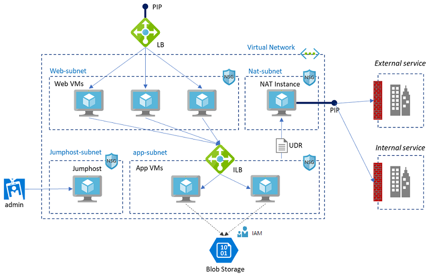

# Azure Workshop: Cloud Architecture

## Overview

This lab will demonstrate how to build a cloud infrastructure (IaaS) on Azure.

A sample cloud-native architecture on Azure.

In this lab, you will create a service with n-tier architecture and you will use `terraform` to create following Azure resources:

- Virtual network and subnet
- VMs (web, app, nat, jumphost)
- LB (external, internal)
- NSG & ASG, UDR
- Blob storage

You will also use `ansible` to install and configure web and app server.

Finally, you will use CLI to configure MSI (Managed Service Identity) for accessing blob storage without accesskey.

## Prerequisite

No installation/tools required to do this HOL.

## Hands on Lab

[Workshop HOL](./ws_hol.md)